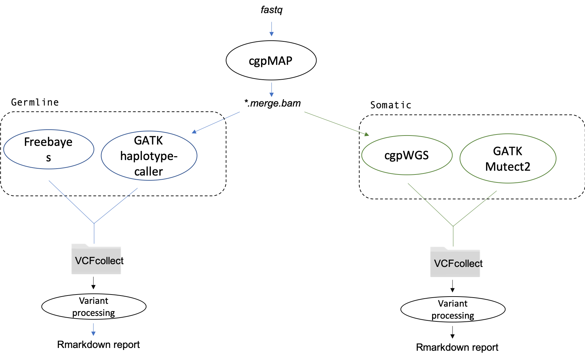
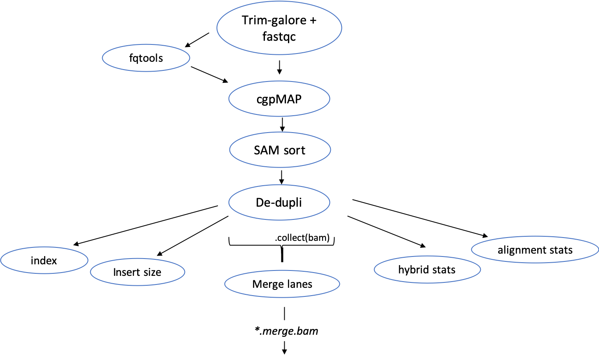

# Variant call pipeline (nextflow)

<!-- TABLE OF CONTENTS -->
## Table of Contents

* [Overview](#Overview)
* [Mapping-exome module](# Mapping-exome module)

## Overview

This github houses the nextflow scripts required to process DNA-seq (WGS and exome) samples from fastq files to calling variants. The pipelines are formed of different modules that can be used in different combinations to fulfil the requried analysis. Below shows a picture-graphic of the modules available currently.




As depicted in figure-1, each module is connected through the last file is produced. For example, the final files that are produced by cgpMAP are bam files with the file extension ''*.merged.bam'. When run, the connecting modules search for files ending in '*.merged.bam' and then start. (Currently) Once the pipeline has determined the number of input files and started, none more can be added. This means that the modules are required to run in succession, which reduces the speed of the overall pipeline.

Each module is comprised of various QC steps to ensure high quality processing of samples. The following sections describes the steps within each module and how it is expected to work.


## Mapping-exome module

The following module performs QC on fastq files and maps them using the sanger cgpMAP container (bwa-mem). Subsequent BAM files are de-duplicated and QC'ed (insert size, hybrid stats, alignment stats). BAM files are collected in order to merge the lanes. Following is a brief breakdown of the processes within the pipeline.



### Trim-galore

Trimgalore requires the index primers to be supplied in order to trim fastQ files. These sequences can be supplied in the input.config file. FastQC option is enabled in order to produce report.

### CgpMAP and fqtools

CgpMAP does not annotate the bam files with information from the fastQ header. Therefore following trimming the fastq files are passed to FQtools which will extract the header for each read pair and a python script (fastq2config_cgpmap.py) to write this into a YAML file. The YAML is passed to cgpMAP which allows the correct headers to be assigned. An example of a YAML output is shown below:

```
SM: S1001
READGRPS:
  S1001_EKDN200000467-1A_HYFMTDSXX_L1_1.fq.gz:
    PL: ILLUMINA
    LB: S1001_TTATCGGC+GATCATCC
    PU: HYFMTDSXX.1
  S1001_EKDN200000467-1A_HYFMTDSXX_L1_2.fq.gz:
    PL: ILLUMINA
    LB: S1001_TTATCGGC+GATCATCC
    PU: HYFMTDSXX.1
```

### BAM QC

The following tools were used:
  - Picard remove duplicates
  - Picard insert size
  - picard hybrid stats
  - picard bam alignment stats

### Merge lanes

Following the removing of duplicates from BAM files, the lanes are merged with supplied information from an excel sheet that is processed by python script (merge_bam_lanes_2.bam). For future work it would be easier to merge all bam files that have the same sample name.
